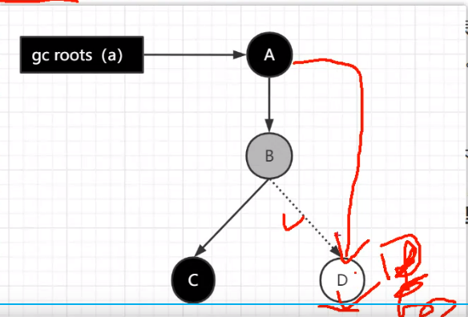

title: 基础

date: 2021-05-25 15:20:36

tags: 基础

categories: 基础

copyright: true

sticky: 0

---

<span id="delete">


</span>

<!--more-->

<h1 id="fastJson">常见问题</h1>

```
dolphinschduler:
	TimeZone 丢失8小时.-e SPRING_JACKSON_TIME_ZONE="UTC"
	变量异常: bizdate: $[yyyy-MM-dd-1] 中间不能有空格
	导入子流程有问题: 官方bug
	表名无法使用变量: 这个用变量去做表名限制也只能是数字. 字符串是用不了的  .字符串会自动加上单引号. 
	正则不能出现?
	DS truncate + insert偶发出现读取数据失败. 可能执行时并不是原子性操作. 采用insert overwrite table 
	字段少了,会引起master状态无法修正 is_cache
doris:
	doris be down : 字段类型不匹配
	doris超时的问题: 修改了doris的超时配置
	如果创建数据分片时超时，也可以通过在 fe.conf 中设置 tablet_create_timeout_second=xxx 以及 max_create_table_timeout_second=xxx 来延长超时时间。其中 tablet_create_timeout_second 默认是1秒, max_create_table_timeout_second 默认是60秒，总体的超时时间为min(tablet_create_timeout_second * replication_num, max_create_table_timeout_second)，
	doris ui不支持非root登录: 模拟接口
	
CK 同步数据失败
	zk启动了4节点
mycat 分库分表无法join
	模拟hash找到精确的表进行join
datax-web 无法支持doris同步
	进行修改迭代
cpu 100%问题
	死锁,死循环,一次性获取大量数据,多线程导数据,同步大量文件,耗时计算,正则匹配,kafka自动确认
并发:
	1.1s 1K 10W请求 100M. 年轻代小了会把对象放进老年代, 频繁引发fullGc
	2.通过代码发现每次在获取信息的时候，若 result 为空，请求都会将查到的 result 信息存入 session ，并且 session 的过期时长为一小时，所以大量的大数据字段存在 session 中，导致服务频繁 FGC 不说，内存也会因此而爆满出现假死情况。找到问题接下来就是处理 session数据了，最终将根据情况选择是去除 session 字段的数据量还是使用 spring session+redis 做分布式 session 存储。
	3. 条件判断出错了.没带条件查询SQL, 一次性查出来大数据
```





    java8 新特性:
    	函数式接口
    	lambada表示式
    	接口默认方法.静态类成员
    	Optaion操作类
    	js引擎
    jmap & 	 jstack &  jstat
      1.可以使用jmap来查看JVM中各个区域的使用情况
      2.可以通过jstack来查看线程的运行情况，比如哪些线程阻塞、是否出现了死锁
      3.可以通过jstat命令来查看垃圾回收的情况，特别是fullgc，如果发现fullgc比较频繁，那么就得进行调优了
      jps -l 查看pid
      jstat -gcutil pid 查看 GC、内存使用情况
      jstack 查看线程
      jmap -dump:format=b,file=test.hprof pid 拷贝一份内存使用情况的快照信息
      
    双亲委派:
    为了安全,自低向上请求加载(问问缓存,缓存有了就返回). 自上向下进行询问加载(自己的加载目录下寻找)
    appClassLoad ,extClassLoad-> URLClassLoad -> SecritryClassLoad -> classLoad.
    
    通过维护parent变量进行引用
    boot根加载器(rt.jar) -> ext扩展类加载器(lib.ext) -> APP应用程序加载器(classPath),线程上下文加载器 -> 自定义加载器
    
    tomcat 打破了双亲委派, 因为统一war包可能会出现不同的类版本.需要自定义实现类加载器去加载
    
    类加载机制
    	加载 -> 链接 -> 初始化
    	
    	加载: 把java字节码加入内存,映射成JVM认可的数据结构
    	链接: resolveClass
    		3小步: 检查验证 -> 准备(创建类或者接口的静态变量,半初始化状态)-> 解析: 创建栈指针,堆内存
    	初始化: 执行初始化零值 ,执行静态方法,构造方法,设置对象头 -> 执行init
    对象的加载机制
    	1、用户创建一个对象，JM首先需要到方法区去找对象的类型信息。然后再创建对象。
      2、JVM要实例化一个对象，首先要在堆当中先创建一个对象。->半初始化状态
      3、对象首先会分配在堆内存中新生代的Eden，然后经过一次Minor Gc，对象如果存活，就会进入S区。
      	在后续的每次GC中，如果对象一直存活，就会在S区来回拷贝，每移动一次，年龄加1。4个bit位 最大15次
      	超过一定年龄后转入老年代
      4.当方法执行结束,栈中指针先移除
      5.堆中的对象经过FULLGC标记为垃圾,再清除
    对象布局:
    	对象头  实例数据  对齐填充
    
    设置对象头: 
    	
    	markword : objectMonnitor : 锁状态 -> 无锁 -> 偏向锁 -> 轻量级锁 -> 重量级锁 
    	kclass pointer - 链接方法区的指针
    	数组的长度
    执行init: 
    	赋初值 . 执行构造方法
    内存分配方式: 
      指针碰撞(相对规整) : 记录分配的起始位置.
      空闲列表(不规则) : 存一个列表.记录了内存的大小和位置
    内存分配的并发
    	CAS : 修改时进行比较是不是当前的值和获取的值一样,一样就修改 不一样就继续循环比较,直到成功
    	TLAB: 每个线程都事先分配一块内存 - thread local allocation buffer   -XX:TLABSize 指定大小
    内存配置的大小
    	maven : 
        org.openjdk.jol 
        jol-core 
        0.9
        ClassLayout layout= ClassLayout.parseInstance(new Object())
        System.out.println(layout.toPrintable()):
    指针压缩
    	开启指针压缩:-XX:+UseCompressedOops
    	对象从8字节压缩到4字节
    JVM线程模型
    	堆: 老年代 + 年轻代 默认2:1, 年轻代: eGen+2个suv  8:1:1
    	栈
    	本地方法栈
    	程序计数器
    	方法区(元数据)
    对象分配
    	打印GC
    	 -Xmx15m -Xms10m -XX:-DoEscapeAnalysis -XX:+PrintGC -XX:+EliminateAllocation
    	 XX:+PrintGC
    	对象逃逸分析 -XX:+DoEscapeAnalysis(开启逃逸分析)
    		public User test(){
    			return new user(); - User对象逃逸了 - 分配到堆上. 进行GC
    		} 
    		public void test(){
    			User user = new user(); 	--- 尝试将user 分配到栈里面. 执行了立即销毁
    			//......保存数据库
    		} 
    	标量替换 -XX:+EliminateAllocations
      	经过逃逸分析了之后发现对象不会被引用 ,但是栈又存不下一整个对象,所以将对象的成员变量给拆散存在栈上
    引用计数法
    	#内存泄漏
    	public class ReferencecountingGc {
    		Object instance = null;
        public static void main(string[] args){
          ReferencecountingGc objA = new ReferencecountingGc();
          ReferencecountingGc objB = new ReferencecountingGc();
          objA.instance = objB
          objB.instance = objA;
          objA = null;
          objB = null;
        }
      }
    可达性分析算法
    	GCROOT 
    		虚拟机栈(栈帧中的本地变量表)中引用的对象
        方法区中类静态属性引用的对象
        方法区中常量引用的对象
        本地方法栈中INI(即一般说的Native方法)引用的对象
    	回收的步骤:
    		对象拥有一次自我拯救的机会。
    		对象被系统宣告死亡至少要经历两次标记过程:第一次是经过可达性分析发现没有与GC Roots相连接的引用链，
    		第二次是在由虚拟机自动建立的Finalizer队列中判断是否需要执行finalize()方法。只能执行一次
    什么样的类能被回收
    	不能有类的实例
    	类的classloader被回收
    	类对象class没有被引用
    GC算法
    	复制算法 -> 一半清空 一半使用,来回倒腾 -> 年轻代
    	标记清除 -> 不要的内存直接标记清除-> 内存碎片  -> 老年代
    	标记整理(标记压缩) -> 存活的对象进行移动,挪动到一块形成一整块  -> 老年代
    CMS 垃圾收集器
    	并发收集器
    	初始标记(STW) -> 并发标记 -> 重新标记(漏标的问题修正,多标先不管了 STW) -> 并发清理 (漏标的标记为黑色不处理,多标的不管) -> 并发重置(重置标记数据)
    	触发full gc 怎么处理
    		concurrent mode failed
    		STW 然后采用serial old 垃圾器来回收
      三色标记算法(白色被删除)
        三色标记算法把Gc roots可达性分析遍历对象过程中遇到的对象，按照“是否访问过”这个条件标记成以下三种颜色:
        黑色: 表示对象已经被垃圾收集器访问过，且这个对象的所有引用都已经扫描过。 
        黑色的.对象代表已经扫描过，它是安全存活的，如果有其他对象引用指向了黑色对象，无须重新扫描一遍。黑色对象不可能直接(不经过灰色对象)指向某个白色对象。
        灰色: 表示对象已经被垃圾收集器访问过，但这个对象上至少存在一个引用还没有被扫描过。
        白色: 表示对象尚未被垃圾收集器访问过。显然在可达性分析刚刚开始的阶段，所有的对象都是白色的，若在分析结束的阶段，仍然是白色的对象，即代表不可达。
    		多标的意思: 
    		 A -> B
         初次扫描的时候B没有引用(本来要被清除),再次扫描的时候B的引用存在了,就多出来一个B的引用
    		解决漏标的问题:
         A
        B C
        开始A对B有引用, B对c有引用, 
        然后执行GC的时候,B对C没有引用,新增了AC引用,
        但是只扫到B,发现B没有引用了,C没有扫描到则标记为白色节点会被删除,就存在漏标的问题
          
          增量更新:
          	将A变成灰色, 下次继续扫描
            单独新加一个集合记录新加的引用.如图 将AC的连线保存起来
          原始快照:	
            将删除的引用保存起来.如图 将BC的连线保存起来
    G1收集
    	为什么要产生G1
    		jvm内存越来越大, 但是几十G的垃圾要是一次性回收时间会很长,所以G1在CMS基础上采用region机制,将内存分块,每次只回收限制时间内的块垃圾
    	初始标记 -> 并发标记 -> 重新标记 -> 筛选回收(可以设置最大停顿时间 -XX:MaxGCPauseMillis)
    	设置最大停顿时间如何实现的?
    		维护一个优先列表,优先选择回收价值最大的Region
    GC是什么时候都能做吗?知道GC安全点与安全区域是怎么回事吗?
        GC不是任何时候都能做的，需要代码运行到安全点或安全区域才能做。
        安全点就是指代码中一些特定的位置，当线程运行到这些位置时它的状态是确定的，这样JVM就可以安全的进行一些操作，比如GC等，
        所以GC不是想什么时候做就立即触发的，是需要等待所有线程运行到安全点后才能触发。
        这些特定的安全点位置主要有以下几种:
          1.方法返回之前
          2.调用某个方法之后
          3.抛出异常的位置
          4.循环的末尾
       	 大体实现思想是当垃圾收集需要中断线程的时候，不直接对线程操作，仅仅简单地设置一个标志位，各个线程执行过程时在上面说的那些安全点位置都会检查这个标志，一旦发现中断标志为真时就自己在安全点上主动中断挂起。
        安全点是对正在执行的线程设定的，如果一个线程处于 Sleep 或中断状态，它就不能响应JVM 的中断请求，再运行到安全点上。
        因此 JVM 引入了安全区域，是指在一段代码片段中，引用关系不会发生变化，在这个区域内的任意地方开始 GC 都是安全的。  
    JVM调优:
    	标准指令: -开头 ,所有hotsport都支持
    	非标准指令: -X开头,通常是和特定的虚拟机版本指定 java -X打印出来
    	不稳定参数: -XX开头,通常是和特定的虚拟机版本指定,变化特别大,文档比较少
    		java -XX:+PrintCommandLineFlags -version
    		java -XX:+PrintFlagsInitial -version 打印不稳定指令的默认值
    		java -XX:+PrintFlagsFinal -version 不稳定指令最终生效值
    	1.逃逸分析 + 标量替换
    	2.年轻代配置大一点
    	3.看别的开源项目.sh里面的options参数
    字符串常量池
      类似于缓存了字符串的池子
      String a = "aa" - > 字面量"aa"直接放在常量池
      String b = new String("aa") - > 字面量"aa"直接放在常量池 , 堆再创一个"aa"的对象指向 b
      String c =  b.intern();  intern首先返回的是b在常量池的字面量,没有就参考下面的示例
      a == b flase
      b == c false
      a == c true
    
    	String a = new String("a") + new String("b") ;
      String b = a.intern(); #常量池没有字面量"ab",所以b就是指向常量池是个空引用的指针->然后常量池指向堆a的引用,所以是同一个地址
      System.out.println(a == b); 1.6是false(因为1.6会加入ab字面量到字符池) 1.7是true
    
    	String str1 = new StringBuilder("ja").append("va").toString(); 
      System.out.println(str1==str1.intern()); false - java , test 已经内置到常量池了
        
      String str1 = new StringBuilder("jaccc").append("va").toString();
      System.out.println(str1==str1.intern()); true - 和示例一样
      
      Integer -128 ~ 127
    
    并发编程  
      原子性
      	synchronied cas lock threadLocal
      可见性
      	共享变量值修改 - volatile synchronied lock final 
      有序性
        as-if 
        happend before 8种规则
        volatile
    实现线程的方式
    	继承Thread类重写run方法
      实现Runnable接口 重写run方法
      实现Callable 重写call方法，配合FutureTask
      基于线程池追其底层，其实也是实现Runnble
    java 线程的状态
    	新建状态new -> 就绪runables -> waiting -> time wating -> blocked -> termiated
    sleep 和 wait区别
      sleep thread 类的方法  object wait区别方法
      sleep 任意地方使用      wait需要synchronied中使用
      sleep 不会释放锁       wait会释放锁
      sleep 设置时间休眠			wait手动唤醒
      线程状态也不一样 time wating    waiting
    停止线程的方式
    	stop 
    	共享变量
    	intreputer 
    CAS 是什么, 优缺点
    	Compare and Swap就是先进行比较，然后替换他在替换内存的某个位置的值时，首先查看内存中的值与预期值是否一致，如果一致执行替换操作。这个操作是一个原子性操作
      缺点: 自旋 (限制次数) + ABA + 多行代码原子性无法保证
      ABA 3个线程操作  -  new AtomicStampedReference<>("AAA", 1); 版本的概念
    什么是伪共享 + @contended
    	在多线程环境下，如果两个或更多的线程在同一时刻分别修改存储在同一缓存行的不同数据，那么CPU为了保证数据一致性，会使得其他线程必须等待-个线程修改完数据并写回主内存后，才能读取或者修改这个缓存行的数据。尽管这些线程可能实际上操作的是不同的变量，但由于它们位于同一缓存行因此它们之间就会存在不必要的数据竞争
    	@contended 减少伪共享的问题. 将cache line 独占一个缓存行
    java中引用类型有那些
    	强 : GC不会回收 
    	软 : 内存不足时GC会回收
    	弱 : GC下次会回收
    	虚	: 需要引用队列结合, 随时会被回收
    java 锁的分类
    	乐观锁 悲观锁
    	公平锁 非公平锁
    	可重入锁 不可重入锁
    	互斥锁(写锁) 共享锁(读锁)
    ThrealLocal 内存泄漏
    	线程未回收, 但是ThreadLocal已经被回收了 弱引用
      public static void main(String[] args)throws IoException {
        test();
        System.in.read();//1.模拟线程还在执行，未关闭
      }
      public static void test(){
        ThreadLocal<String>threadLocal =new ThreadLocal<>();
        threadLocal.set("Hello");
      }
    synchronized 是什么
    	synchronized 锁住的是对象头-> markword -> objectmonitor 
    	优化:
        锁消除 - 没有竞争就消除
        锁膨胀 - 循环中频繁获取释放资源,放在循环外面
        锁升级 -  objectmointor中存在标记位:
        	无锁 - 当做没有锁
        	偏向锁 只有一个线程获取锁,直接拿锁,如果不是当前线程就需要采用CAS尝试获取锁, 获取不到就升级为轻量级锁
        	轻量级锁: CAS获取锁,多次获取不了就升级
        	重量级锁: 拿不到锁就挂起,一直等待
        1.偏向锁:在锁对象的对象头中记录一下当前获取到该锁的线程ID，该线程下次如果又来获取该铁就可以直接获取到了
        2.轻量级锁:由偏向锁开级而来，当一个线程获取到锁后，此时这把锁是偏向锁，此时如果有第二个线程来竞争锁，偏向锁就会升级为轻量级锁之所以叫轻量级锁，是为了和重量级锁区分开来，轻量级锁底层是通过自旋来实现的，并不会阻塞线程
        3.如果自旋次数过多仍然没有获取到锁，则会升级为重量级锁，重量级锁会导致线程阻塞
        4,自旋锁:自旋锁就是线程在获取铁的过程中，不会去阻基线程，也就无所谓唤醒线程，阻塞和唤醒这两个步骤都是需要操作系统去进行的，比较消耗时间，自旋铁是线程通过CAS获取预期的一个标记，如果没有获取到，则继续备环获取，如果获取到了则表示获取到了锁，这个过程线程直在运行中，相对而吉没有使用太多的操作系统资源，比较轻量
        
    AQS是什么
    	首先AQS中提供了一个由volatile修饰，并且采用CAS方式修改的int类型的state变量。
    	其次AQS中维护了一个双向链表，有head，有tail，并且每个节点都是Node对象。
    	通过addWaite 将没有获取到锁的加入队列
    	为什么从后遍历获取node:
    		1.从前遍历很有可能得到一个null节点导致死锁
    		2.enq方法创建节点是先建前驱节点. 出现并发时后驱节点不一定会建好. 所以往后遍历会好一点
    sy和retrennlock区别
    	1. 灵活性
    	2. 关键字和类
    	3. sy非公平锁 , retrennlock 都有实现
    	4. 出处 
    	5. 控制时间
    	6 sy 实现基于objectmonitor,锁升级    retrennlock 是AQS实现
    retrennReadWritelock实现原理
    	当前线程持有读锁时,不能获取写锁
    		不管读锁是不是当前线程持有, 只要被占用就不能获取写锁
    	当前线程持有写锁时,可以获取读锁
    		当前线程没有写锁,,但是写锁被其他线程占用,则不能获取读锁
    java 提供哪些线程池服务
    	newFixedThreadPool 线程数是固定的
    	newSingleThreadExecutor 单例线程池，线程池中只有一个工作线程在处理任务
    	newCachedThreadPool 缓存的线程池，任务只要提交到当前的newCachedThreadPool中，就必然有工作线程可以处理
    	newScheduleThreadPool 定时任务的线程池，而这个线程池就是可以以一定周期去执行一个任务，或者是延迟多久执行一个任务一次
    	newWorkStealingPool forkjoin pool 
    线程池状态
    	运行(running) 
    	关闭(shutdown)  不再接收任务,任务会执行完毕
    	停止(stop)  不再接收任务,正在执行的任务立即终止
    	整理(tiding) 如果所有的任务都已终止了，workerCount (有效线程数) 为0 ,线程池进入该状态后会调用 terminated() 方法进入 TERMINATED 状态。
      销毁(terminated)
    如何添加一个工作线程
    	addWork : 1.增加各种校验(线程池状态,任务数等等),然后通过CAS将线程数+1  2.创建并启动线程
    线程池为什么要构建空任务的非核心线程
    	因为可能会出现阻塞队列有任务时，并没有核心线程来处理的情况。
    		构建线程池时设置的核心线程数为0
    		设置参数allowCoreThreadTime0ut让核心线程空闲超时移除
    线程池为什么要shutdown
    	内存泄漏 Work对象 和 ThreadPoolExecutor 都不会被回收
    线程池核心参数如何设置
     io密集 或者 io计算
    内部类.函数式接口传入的变量为什么要是final
    	因为外部传入的变量会被回收,内部引用就会报错,所以变量需要保存一个副本在内部类中
    	但是外部要是修改了变量, 内部无法感知. 所以不能修改final
    copyonwriteArrayList
    	1.写的时候加锁 ,复制一个新数组,长度+1,, 读操作在原数组进行
    	2.写操作结束之后将原数组指向新数组
    hashmap
    	 数组 + node节点
    	
    hashmap的扩容机制
    	针对数组扩容
    	1.7 新数组2倍: 双层for循环,遍历数组+链表
    	1.8 新数组2倍: 循环,如果数组是红黑树,判断新数组能否建立红黑树,不到8个就是链表 8个就红黑树
    currenthashMap
    	读无锁: 采用了volite修饰
      jdk7 
        两次hash,第一次找sigment,第二次找数据下标
        分段锁: 存在很多个sigment -> 每个sigment 是数组+链表+红黑树
      jdk8
      	锁住链表的head节点
        数组 + 链表(红黑树)
        cas + synchronized 确保线程安全
        锁粒度更小
        扩容:阻塞读写操作 
    currenthashMap 散列算法
    	无符号右移16为 高低位异或运算 , 再& 上 011111111 为了确保是正数 
    currenthashMap 初始化数组
    	inittable 懒加载
    	sizectl  -1是初始化 0表示还没有初始化  -2 2个线程正在扩容
    currenthashMap 扩容流程
    	达到阈值,触发扩容 
    		1. 链表长度大于等于8时,转为红黑树的时候,如果判断链表长度小于64,尝试扩容
    		2. putALL size 长度过大
    		3. put 达到阈值0.75
    	创建hash表-比原来大两倍,计算扩容撮
    	分段迁移数据 - 计算分成多少段
    	数据迁移 - 分段迁移数据
    	完成迁移- 写锁,且最后一个线程会检查是否迁移完成
    currenthashMap 计数器
    	putval()的时候内部通过addCount()方法实现
      并发量不高时，会通过baseCount进行追加
      并发量较高时，切换到CounterCell数组来计数
      调用size()方法 获取counterCell数组和baseCount里面所有值的和
    currenthashMap 读取数据的流程
    	get(key) -> key经过hash散列计算得到hashcode -> 数组获取是否为null -> 判断key equals 数组的key -> 如果数组的hash< 0 ->迁移新数组去遍历 | 红黑树遍历 | 双向链表遍历 -> 返回value
    currenthashMap 为什么不允许key value 是null
    	 多线程情况下不知道真的存储了null还是说报错返回了null,避免歧义
    wait , join , sleep , ylied
    	Object.wait: 会释放锁
    	
    	Thread.ylied: 让出线程,重新参与调度
    	Thread.sleep: 不会让出线程
    	Thread.join(): 阻塞线程, 线程A调用线程B的join
        public static void main(String[] args){
          Thread thread = new Thread(() -> {
            System.out.println("A");
            Thread.sleep(5000);
          });
          thread.start();
          thread.join();
          System.out.println("mian");
        }
    
    在服务出现不可用的时候可以通过查看 Linux 服务器的 message 日志，查看服务是宕机还是假死及（有无进程）服务还有进程（假死）：
      使用 top 观察 CPU 使用率
      jps -l 查看pid
      jstat -gcutil pid 查看 GC、内存使用情况
      jstack 查看线程
      jmap -dump:format=b,file=test.hprof pid 拷贝一份内存使用情况的快照信息
      WIN + R 输出 CMD 后打开 jvisualvm选择左上角导入 hprof 日志，观察内存实例，哪些占内存比较大，定位到大对象位置。
    ThreadLocal
    	每个线程都有自己的一个ThreadLocalMap对象,ThreadLocalMap是在ThreadLocal类中的的一个static class . 
    	Threalocal通过 key 是通过弱引用引用 ThrealLocal对象value是缓存的值
    	A线程不结束, 比如监听socket -> key是弱引用被回收, value值一直存在,造成内存泄漏
    fork/join 框架
    	很长的数据拆分成2半  继续拆分,拆分到最小的子任务( a b ) -> 双指针进行两个数组比较,直到比较完成, 继续向上比较合并 
    volitate关键字
    	原子性
    	可见性
    	有序性
    守护线程
    	为所有的用户线程服务的
    	守护线程是所有用户线程的守护线程
    	线程池中守护线程会转为用户线程
    	如:GC垃圾回收线程
    ArrayList . linkedLsit
    1. 数据结构, 动态数组 , 链表
    2. 空间使用 ; 连续   碎片化
    3. 读取: 随机读   遍历读
    4. 插入: 移动元素,容量不够还要扩容,如果采用尾插法效率会更高, 更改前后指针,创建node对象
    5. linkedLsit indexof get 都会for循环

# 服务

```
负载均衡算法
	轮询算法
	加权轮询
	随机算法
	EDF deadline放在队列
	最小链接 最小链接放在队列
	hash算法
分布式ID
	UUID
	数据库自增ID
	数据库集群模式产生ID
	数据库号段模式
	redis incr 实现
	雪花算法 64bit 
		第一个部分是1个b:0，正数
		第二个部分是 41个bit:表示的是时问戳。单位是亳秒。41bit可以表示的效字多达2^41-1，也就是可以标识2A41-1个毫秒值，换算成年就是表示 69 年的时间。
		第三个部分是5个bit:表示的是机房id5个bit 代表机器id。意思就是最多代表2M5个机房(32 个机房)
		第四个部分是5个bit:表示的是机器id。每个机房里可以代表25个机器(32 台机器)，也可以根据自己公司的实际情况确定。
		第五个部分是12个bit:表示的序号，就是某个机房某台机器上这一毫秒内同时生成的id 的序号。
		12bit 可以代表的最大正整数是2A12-1=4096，也就是说可以用这个12 bit 代表的数宇来区分同一个毫秒内的4096个不同的id.
		总结:简单来说，你的某个服务假设要生成一个全局唯一id，那么就可以发送一个请求给 SnowFlake 算法的系统上由这个SnowElake 算法系统来生成唯- id。
	百度uid-generator
	美团(leaf)
	滴滴(tinyiD)
MQ实现分布式事务: A系统操作 -> 消息队列 -> B系统消费
  1. 本地事务表: 
    引入本地消息表来保证本地事务与发送消息的原子性，加入定时任务将消息表中未被成功处埋的记录通过M0投递至关联服务，利用ACK机制确保可靠性，去重表确保幂等性
    A系统操作日志落mysql库->发送消息->消息回调ACK确认->更改数据库状态  
    轮询->未确认的的消息->继续放进队列
    B系统消费 :  幂等性保证 , 手动确认ACK 
  2. 基于RocketMQ的事务消息
    RocketMQ中提供了所谓的事务消息，当RocketM0确定消息已经发送成功后，事务发起方即会开始执行本地事务。
    当RocketMQ得到commit状态，则会将之前的事务消息转为对消费者可见、并开始投递
  3. XA事务
    本地事务-引入XA包,将数据库和MQ的发送消息变成一个事务
如何划分微服务
	人和团队
	职责边界
	最小化变更
	最大化复用
	性能稳定
如何划分微服务指责
		单一职责
		松耦合
		可组合
		可替换
		持续集成和更新能力
如何检查微服务划分的合理性
	领域检测: 领域模型: 工单啊 
	DAG检查: 双向循环
	分布式事务检查
	性能分布检查
	稳定性和易变性 : 不要放在一块
	调用链: 控制链路长度
BASE理论
  BA 基本可用
  S 软状态
  E 最终一致性
CAP理论 
	C: Consistency(一致性) 
	A: Availability(可用性)
	P: Partition Tolerance(分区容错性)
	EUREKA 是AP
	zk 是cp
ACID理论
  A：Atomicity，原子性。
  C：Consistency，一致性。
  I：Isolation，隔离性。
  D：Durability，持久性。	
Seeta SAGA分布式事务模式
	切分多个本地事务
注册中心是什么数据存储结构
	ZK: 文件目录, ZNODE 不能超过1M
	EUREKA: 数据存储 + 数据缓存: 第一层是map的不过期时间的数据 第二层是过期时间的guava的缓存
spring cloud 全家桶有哪些组件	
  1.服务注册与发现：Eureka是一个服务注册中心，它负责服务的注册与发现。只有当服务注册到注册中心后，其他服务才能发现并调用它。
  2.配置中心：Config是一个分布式配置中心，它支持本地仓库、SVN、Git、Jar包内配置等模式。
  3.全链路监控：Spring Cloud通常可以结合使用Zipkin、SkyWalking或Pinpoint等组件来实现。
  4.服务网关：Zuul是一个API服务网关，它负责路由分发和过滤等功能。
  5.负载均衡：Ribbon是一个客户端负载均衡组件，它具有区域亲和和重试机制等特性。
  6.熔断器：Hystrix是一个客户端容错保护组件，它具有服务降级、服务熔断、请求缓存、请求合并和依赖隔离等特性。
  7.Hystrix Dashboard是用于监控Hystrix的集群模式和单点模式的工具，
  8.收集器Turbine集群模式需要配合使用。
  9.Feign是一个声明式服务调用组件，它本质上是Ribbon+Hystrix Stream的结合，具有订阅发布、消费组和消息分区等特性。
  10.消息总线：Bus是消息总线组件，它配合Config仓库进行修改，实现了消息驱动的功能。
  11.分布式服务追踪：Sleuth是用于分布式服务追踪的组件，它需要搞清楚TraceID和SpanID以及抽样，同时也可以与ELK进行整合。	
  12. 分布式事务: seeta / MQ
```

# ---

```
B树: 一个节点存储多个元素
B+树: 叶子结点有相互连接的指针,叶子结点存储了所有的数据 2层B+树大概2千万数据

常见锁
  行锁  innodb 加锁力度小,但是资源开销大 
    共享锁: 读锁 select * from test lock in share mode
    排他锁: 写锁 select * from test for update , update delete insert 会自动加写锁
    自增锁: 自增字段 , 数据会回滚,自增序列不会滚
  表锁  myisam innodb 
    共享锁: 读锁 select * from test lock in share mode
    排他锁: 写锁 select * from test for update
    意向锁: innodb自动添加
  全局锁 flush tables with read lock

  常见锁算法
    记录锁
      update user set xx where userid=4
    间隙锁 
      REPEATABLE READ 下会加间隙锁 锁住5-9行 , 锁一定的范围
    Next-key 
      间隙锁+右记录锁
索引结构
	二叉树: 每个节点最多只有两个子节点， 左边的子节点都比当前节点小，右边的子节点都比当前节点大。
	AVL树: 树中任意节点的两个子树的高度差最大为1
	红黑树:
    1 每个节点都是红色或者黑色。
    2 根节点是黑色。
    3 每个叶子节点都是黑色的空节点。
    4 红色节点的父子节点都必须是黑色。
    5 从任一节点到其每个叶子节点的所有路径都包含相同的黑色节点。
	B-树: 
    1、B-树的每个非叶子节点的子节点个数都不会超过D(这个D就是B-树的阶)
    2、所有的叶子节点都在同一层。
    3、所有节点关键字都是按照递增顺序排列。
  B+树:
  	1、每个非叶子节点的子节点个数都不会超过D(这个D就是B+树的阶)
    2、非叶子节点不存储数据，只进行数据索引。
    3、所有数据都存储在叶子节点当中。
    4、每个叶子节点都存有相邻叶子节点的指针。
    5、叶子节点按照本身关键字从小到大排序。
聚簇索引 & 非聚簇索引 
	节点上数据和索引在一块就是聚簇索引
	非聚簇索引  mysiam 索引和数据在两个文件
	innodb 主键建立聚簇索引 ,没有主键就是非空unique ,在没有就是隐藏row-id作为聚簇索引  只会有一个聚簇索引
覆盖索引 和 回表
	查询的字段建立索引,查询的数据能直接在索引获取数据就不要回表查询了
	select count(name) from user;->在name 字段上建立一个索引,
	select id,name,sex from user; ->将name上的索引升级成为(name.sex)的联合素引
innodb 如何实现事务的
  innodb通过BufferPool,logBuffer，RedoLog，undolog来实现，以一个update为例:
  1.Innodb在收到一个update语句，会先根报条件找到数据所在的页，并将该资缓存在BuerPool中
  2、执行update，修改BufferPool中的数据，也就是内存中的数据
  3.针对update生成一个RedoLog对象，并存入logBuffer
  4.针对update生成undolog日志，用于事务回滚
  5.如果事务提交，那么RedoLog对象进行持久化，后续还有其他机制将BufferPool中所修改的数剧页持久化到磁盘中
  6.如果事务回滚，则利用undolog日志进行回滚

  Bin log  记录的是逻辑日志，它以追加的方式记录数据库的修改操作，采用二进制格式进行存储。 
  Redo log 以循环写入的方式记录数据库的修改操作，采用固定大小的物理日志文件进行存储。记录了数据库页的物理修改，而非语句级别的逻辑操作。
  Undo log 以逻辑方式记录数据库事务的修改操作，它记录了事务执行过程中旧值的备份，以便在事务回滚或并发控制需要时能够恢复数据。反向记录的数据
  
Explain字段含义
	id 查询语句中每出现一个SELECT关键字，MySQL就会为它分配一个唯一的id值，某些子查询会被优化为join查询，那么出现的id会一样
  select type SELECT关键字对应的那个查询的类型
  table 表名
  partitions 匹配的分区信息
  type 针对单表的查询方式(全表扫描、索引) - all , ref ,const
  possible_keys 可能用到的索引
  key 实际上使用的索引
  key_len 实际使用到的索引长度
  ref 当使用索引列等值查询时，与索引列进行等值匹配的对象信息
  ГOWS 预估的需要读取的记录条数
  filtered 某个表经过搜索条件过滤后剩余记录条数的百分比
  Extra -些额外的信息，比如排序等
MySQL 支持多种存储引擎，每种存储引擎都有其独特的特点和适用场景。以下是一些常见的 MySQL 存储引擎：
  InnoDB 
    是 MySQL 的默认存储引擎。
    支持事务处理、行级锁定和外键。
    提供了崩溃恢复能力和多版本并发控制（MVCC）。
    对于需要处理大量事务的应用，InnoDB 是一个很好的选择。
  MyISAM 
    引擎不支持事务处理，也不支持行级锁定。
    它使用表级锁定，所以并发写操作可能会导致性能问题。
    MyISAM 引擎通常用于只读操作或只读/偶尔写入的场景。
    MyISAM 引擎在处理非事务性的工作负载时，通常比 InnoDB 更快。
  Memory（或 HEAP）：
    所有数据都存储在 RAM 中，因此速度非常快。
    但是，如果服务器重启或崩溃，数据会丢失。
    通常用于临时表或需要快速访问的数据。
  Federated 
    存储引擎允许用户访问远程 MySQL 服务器上的表。
    它实际上不存储数据，而是提供了一个指向远程服务器的指针。
  CSV：
    这是一个简单的存储引擎，它将数据存储在 CSV 文件中。
    通常用于与其他应用或系统交换数据。
  Archive：
    Archive 存储引擎用于存储和检索大量的归档数据。
    它使用行级压缩来最小化存储空间。
    只支持 INSERT 和 SELECT 操作。
  Blackhole：
    Blackhole 存储引擎接收并忽略所有写入操作。
    当你想要一个只读的视图或副本，但不想实际存储数据时，可以使用它。
    NDB（或 Cluster）：
  NDB 是 MySQL Cluster 数据库管理系统的存储引擎。
    它为分布式环境提供了高可用性、数据冗余和故障转移功能。
    每种存储引擎都有其优缺点，所以在选择存储引擎时，需要根据应用的需求、性能要求、数据一致性要求等因素进行综合考虑。 
索引类型
	哈希索引/bTREE/主键索引/唯一索引/联合索引/全文索引(倒排)/R-Tree 索引/空间索引（Spatial Index）
事务隔离级别
	null 
	read uncommited (允许脏读) 
	read commited (防止脏读,不可重复读) 
	read repeabtable(防止脏读和不可重复的读)(出现幻读) 
	serilize(串行)
	脏读:B事务执行读到了A未提交的数据
	不可重复读: A事务多次查询,但是结果每次都不一样
	幻读: A事务查询多次,得到的记录不一样
	
MVCC 多版本并发控制 
	innodb 会存隐藏两个字段
		trx_id 字段修改的事务id
		roll_pointer 指向老版本id的指针
	每次新事务都会生成readview  - 维护当前的活动事务ID.是一个数组[10,20]
	读取数据的时候获取最大的trx_id进行对比
		比数组10小. 那证明之前的事务已经提交,数据可读
		比数组20大或者在数组中间15. 那证明事务不可读数据, 获取版本链中的roll_pointer (即上个版本指针,继续作比较,直到获取数据)
	可重复读: 不会生成新的readview
  不可重复读: 每次都会生成新的readview
ACID
	a: 原子性
		要么成功 要么失败
	C: 一致性
		2个事务: 数据要达到一致
	I: 隔离性
		2个事务,最终提交前.资源是不可见的
	D: 持久性
索引的设计规则
	查询语句效率更高, 存储更小
  1.适合系引的列是出现在where子句中的列，或者连接子句中指定的列
  2.基数较小的类!索引效果较差，没有必要在此列建立索引
  3.使用短索引，如果对长字符串列进行索引，应该指定一个前缀长度，这样能够节省大量索引空间
  4.不要过度索引。索引需要额外的磁盘空间，并降低写操作的性能。
  5.定义有外键的数据列一定要建立索引。
  6.更新频繁字段不适合创建索引
  7.若是不能有效区分数据的列不适合做索引列(如性别，男女未知，最多也就三种，区分度实在太低)
  8.尽量的扩展索引，不要新建索引。比如表中已经有a的索引，现在要加(a,b)的索引，那么只需要修改原来的索引即可。
  9.对于那些查询中很少涉及的列，重复值比较多的列不要建立索引。
  10.对于定义为text、image和bit的数据类型的列不要建立索引。
索引覆盖
	当前的SQL查询出来的字段都在索引字段上,索引字段在叶子结点已经存在数据.就不需要进行回表
分片执行流程
	解析SQL -> sql路由 -> SQL改写 -> SQL执行 -> 归并结果
sql 耗时
  慢查询的优化首先要搞明白慢的原因是什么?
  	是查询条件没有命中索引?是load了不需要的数据列?还是数据量太大?
  所以优化也是针对这三个方向来的，
  	首先分析语句，看看是否load了额外的数据，可能是查询了多余的行并且抛弃掉了，可能是加载了许多结果中并不需要的列，对语句进行分析以及重写。
  	分析语句的执行计划，然后获得其使用索引的情况，之后修改语句或者修改索引，使得语句可以尽可能的命中索引。
  			type: ref const system all
  	如果对语句的优化已经无法进行，可以考虑表中的数据量是否太大，如果是的话可以进行横向或者纵向的分表。
最左匹配原则
	B+数底层是排序的 a b c . 如果条件是 b a c 就用不了
  1. 使用 LIKE 运算符，且该运算符的参数模式不是从开头开始的。比如 LIKE '%abc'。MySQL无法使用索引进行查找，因为它无法预测字符串的开始位置。
  2. 使用 OR 运算符连接了索引列与非索引列的查询条件。例如，如果你有一个索引包含列a和列b，但你的查询条件是 WHERE a=1 OR b=2，那么索引将不会被使用。
  3. 索引列参与了函数计算。例如 WHERE YEAR(date) = 2024，这样会使索引失效，因为MySQL不能预测函数的结果。
  4. 索引列在 WHERE 条件中使用了 != 或者 <> 运算符。例如 WHERE column != value。MySQL不能有效地使用索引，因为它需要检查所有行以找出不匹配的行。
  5. 对索引列进行类型隐式转换，例如字符串类型的索引列与数字进行比较，这时MySQL会将索引列的类型进行转换，使得索引失效。
  6. 数据类型不一致。如果列的数据类型和索引的数据类型不一致，即使使用了最左前缀，也可能导致索引失效。
  注意，即使在这些情况下，MySQL可能仍然选择使用索引，但是这将导致性能下降，因为它必须检查索引的每个条目，而不能有效地利用索引结构进行快速搜索。
```

# ---

```
Redis线程模型
	基于reactor的网络事件处理器,
	文件事件处理器(单线程): 包含4个部分:多个socket、I0多路复用程序、文件事件分派器以及事件处理器(命令请求处理器、命令回复处理器、连接应答处理器等)
  IO多路复用: 根据监听多个socket,根据socket上不同的事件进行响应
  多个Socket可能并发的产生不同的操作，每个操作对应不同的文件事件，但是I0多路复用程序会监听多个Socket，会将Socket放入一个队列中排队，每次从队列中取出一个Socket给事件分派器，事件分派器把Socket给对应的事件处理器。
  然后一个Socket的事件处理完之后，10多路复用程序才会将队列中的下一个socket 给事件分派器。文件事件分派器会根据每个Socket当前产生的事件，来选择对应的事件处理器来处理。
客户端 -> 多个socket -> I0多路复用程序(队列) -> 事件派发器 -> 事件处理器

RDB	: dump.rdb 只会存在一份
  save -进行阻塞
  bgsave - fork一个子进程进行备份, 然后采用copyonwrite机制保证数据一定是某个时刻的数据
	自动触发
		save m n 内部是使用 bgsave
		flush all  flush db  删除原dump.rdb文件,生成新的dump.rdb文件,内容为空
		主从同步: 全量同步会触发bgsave
AOF:
	保存每一个redis的操作命令
	通过AOF缓冲区进行写入
	需要定期对AOF文件进行重写(rewirte 压缩)
	每s一次 / 写一次保存一次 / 不同步(由系统同步) sfync
	AOF文件大小比RB文件大,恢复速度慢 , 但是数据全,优先加载AOF
过期键删除策略
	惰性 (查询的时候去判断)
	定期 ( 到了时间扫描部分的过期key进行删除)
		固定时长内,遍历每个datadase,检查当前库中指定个数的key20个,随机抽查有过期就删除,并且有变量记录扫描到哪一个库
		控制执行频率和执行时长
	定时(redis -未使用 ,每个key都带上一个定时器)

redis集群方案
	1. 主从模式 - 容量上限,依赖于master的内存大小
		psync 第一次 全量复制
		不是第一次: psync runId offest 进行增量复制
		
  	全量复制: bgsave fork 一个子线程,生成一个RDB,通过网络发送RDB文件,从节点: 老数据清空,载入bgwriteRDB文件(阻塞)
  	增量复制: 主从节点都维护一个偏移量
  		1.复制一个偏移量,已主节点为准
  		2.复制主节点的积压缓冲区(队列)
  	服务器运行ID(runId): 
  		主节点发送给从节点进行保存,从节点ID不一致了采用全量复制
  		积压缓冲区放不下了,只能进行全量复制
	2. 哨兵模式 - 基于主从模式
		1.监控主从节点是否有故障 2.消息通知 3.故障转移 4.通知client配置
		如果哨兵挂掉了,集群还是能正常工作
	3.redis-cluster
		服务端实现分片
  	分成redis hash slot 一共16384槽.每个节点均匀分布存储一定哈希槽
  	每个节点都是从节点也是主节点
  4. redis-Sharding
  	每个节点都是独立的,不能共享
  	客户端实现分片-客户端哈希
redis数据结构
	字符串 
	hash : 存储对象
	list : 队列,栈
	set : 集合, 并集(共同关注)
	sorted set : 排名
缓存淘汰算法:
		FIFO: 先进先出
	  LRU: 最近最少使用(时间)  根据最近被使用的时间，离当前最远的数据优先被淘汰;
    LFU: 最不经常(次数)使用 在一段时间内，缓存数据被使用次数最少的会被淘汰。
缓存淘汰策略:
	有过期时间的/所有健
	  随机删除
		先进先出
    LRU: 最近最少使用
    LFU: 最近最频繁使用
缓存方案:
  客户端缓存:页面和浏览器缓存，APP缓存，H5缓存，localStorage和sessionStorage
  CDN缓存:内容存储:数据的缓存，内容分发:负载均衡
  nginx缓存:静态资源
  服务端缓存:本地缓存，外部缓存
  数据库缓存:持久层缓存(mybatis，hibernate多级缓存)，mysql查询缓存
  操作系统缓存:Page Cache、Buffer Cache
缓存穿透,缓存击穿 缓存雪崩
		缓存穿透:
      redis没有,数据库也没有,不停的根据不存在的ID查询一个null
      1.数据合法性的校验,不合法的请求拦截
      2.缓存一个id = null key 设置一个短的过期时间,要是重复的id再次请求key更新过期时间
      3.布隆过滤器.将数据库的数据缓存在bool , int 4*8 32字节  , 然后不存在的ID进来直接过滤
		缓存击穿:
      redis没有,数据库存在,大量请求请求到数据库
      1.可以采用rennlock读写锁进行判断,为了增加性能
      2.采用分布式锁进行缓存更新
      3.设置热点数据永不过期, 延时双删
		缓存雪崩:
			大量的键同一时间过期, 
			1.设置过期时间加上随机数
			2.设置热点数据永不过期
			3.可以增加锁
Redis锁
	setnx + setex 非原子性的
	set key val nx px xx 一条命令 原子性的 - 存在锁过期了但是任务还没有执行完成
	redission 开启一个线程watch - 判断任务是否执行完成, 没有执行完成增加过期时间
	锁不是自己的问题: lua脚本 + 判断+删除保证一致性
	不可重入: 采用Redission + 采用AQS计数器机制思想
	异步复制造成锁丢失: redlock,顺序向5个节点申请锁,超时的节点跳过,至少3个节点获取成功才成功,获取锁的时间要小于过期时间
redis 9大数据结构
	字符串 , hash , list , set , sorted set
	bool过滤器 bitmap , GeoHash 经纬度坐标(基于sorted set), HyperLogLog 统计不重复数据(大数据基数统计) , Streams (内存版kafka)
redis事务实现
	watch 采用乐观锁机制,CAS监控事务的每一个key , 当key发生变化 , 事务会取消
	
	-> 事务开启 (muti) - 开启flag - redis_muti
	-> 命令入队(muti exec discard watch 会立即执行) - 只检查语法-先进先出
	-> 事务执行(exec) - 如果标识不是redis_muti或者包含其他则取消
Redis和Mysql如何保证数据一致
	首先redis是删除而不是更新. 因为删除会更快
	所以先删除缓存还是先写数据库? --------------只能保证最终一致性.只要有写就一定会出现一段时间内数据不一致
	1.先写数据库,再删除缓存 - 1.缓存可能删除失败(采用重试机制),从而继续老数据 2.一段时间还是老数据
	2.先删缓存,再写数据库 - A线程删除了缓存 B线程继续读取老数据更新缓存 , 同样数据库写失败,还是老数据的缓存
  3.延时双删，步骤是:先删除Redis缓存数据，再更新Mysql，延迟几百毫秒再删除Redis缓存数据，这样就算在更新Mysql时。有其他线程读了MySql，把老数据读到了Redis中，那么也会被期除掉，从而把数据保持一致	,如果写数据操作频繁,会有脏数据的问题
	4.发送一个消息MQ - 同时更新数据库,更新redis
	5.key永不过期,增加逻辑过期时间, 采用后台线程去扫描过期时间进行删除
	6.先操作缓存，但是不删除缓存。将缓存修改为一个特殊值(-999)。客户端读缓存时，发现是默认值，就休眠小会，再去査一次Redis。-》 特殊值对业务有侵入。 休眠时间，可能会多次重复，对性能有影响。
	7. 加锁串行化: 缓存删除 -> 写放入有序队列 -> 读也放入队列  - 将队列水平拆分

```


