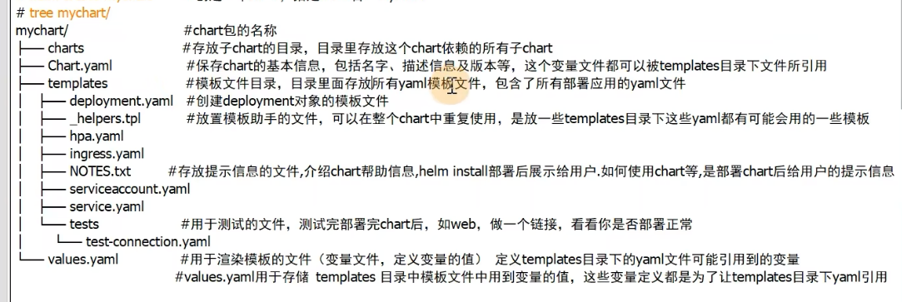

title: helm

date: 2021-05-25 15:20:37

tags: helm

categories: helm

copyright: true

sticky: 0

---

<span id="delete">


</span>

<!--more-->

# 原始文档

```
other->学习资料->k8s集群编排工具helm3实战教程资料.zip
```

# helm

```
1).helm3移除了Tiller组件

	helm2中helm客户端和k8s通信是通过Tiler组件和k8s通信,helm3移除了Tiler组件,直接使用kubeconfig文件和k8s的.apiserver通信

2).删除 release 命令变更
	#helm delete release-name --purge  ->>  helm uninstall release-name

3).查看 charts 信息命令变更
	#helm inspect release-name  ----->> helm show release-name
4).拉职 charts 包命令变更
	#helm fetch chart-name------------->> helm pull chart-name
5).helm3中必须指定release 名称，如果需要生成一个随机名称，需要加选项--generate-name，hem2中如果不指定release名称，可以自动生成-个随机名称
	#helm install ./mychart --generate-name
```

# helm安装

```
wget https://get.helm.sh/helm-v3.6.0-linux-amd64.tar.gz
tar -zxvf helm-v3.6.0-linux-amd64.tar.gz
mv ./linux-arm64/helm /usr/local/bin/helm
helm version
```

# helm 概述



```
# 第1个helm程序
helm create mychart
tree mychart/
cd mychart/
cd templates/
rm -rf *
vi configmap.yaml
  apiVersion: v1
  kind: ConfigMap
  metadata:
    name: mychart-configmap
  data:
    myvalue: "hello world"
cd ~
helm install myconfigmap ./mychart/
helm list
helm get manifest myconfigmap
kubectl get configmap 
kubectl describe configmap myconfigmap

helm uninstall myconfigmap

# 第2个helm程序-变量
vi mychart/templates/configmap.yaml
  apiVersion: v1
  kind: ConfigMap
  metadata:
    name: {{ .Release.Name }}-configmap
  data:
    myvalue: {{ .Values.MY_VALUE }}
vi mychart/values.yaml
	MY_VALUE: "hello world"
helm install myconfigmap ./mychart/	

# 试运行
helm install myconfigmap ./mychart/ --debug --dry-run
```

#  通用验证

```
# 查看模版
helm get manifest myconfigmap

# 查看模版
kubectl get configmap 
kubectl describe configmap myconfigmap

# 试运行
helm install myconfigmap ./mychart/ --debug --dry-run
```


# 内置对象

```
规则:
values.yaml中配置的大小写不敏感 
- abc: "dsdsdsd" 使用就是 .Values.abc
其余文件如Chart.yaml中配置内置对象都需要首字母大写才能读取: 如.Chart.Description


Release 对象 - 描述了版本发布自身的一些信息。它包含了以下对象:
.Release.Name        release 的名称
.Release.Namespace   release 的命名空间 
.Release.IsUpgrade   如果当前操作是升级或回滚的话，该值为true
.Release.IsInstall   如果当前操作是安装的话，该值为 true
.Release.Revision    获取此次修订的版本号。初次安装时为1，每次升级或回滚都会递增
.Release.Service     获取渲染当前模板的服务名称。一般都是 Helm

Values 对象 - 描述的是value.yam 文件(定义变量的文件)中的内容，默认为空。使用Vàlue 对象可以获取到value.yaml文件中已定义的任何变量数值
变量数值					 获取方式
name1: test1     .Values.name1
info:
  name2: test2   .Values.info.name2

Chat 对象 - 用于获取Chart.yam 文件中的内容:
对象名称  		   描述
.Chart.Name	   获取Chart的名称
.Chart.Version 获取Chart 的版本

Capabilities对象 - 提供了关于kubernetes集群相关的信息。该对象有如下方法:
对象名称                              		描述
.Capabilities.APIVersions								返回kubernetes集群 API 版本信息集合
.Capabilities.APIVersions.Has "apps/v1/Deployment" 	用于检测指定的版本或资源在k8s集群中是否可用，例如:apps/v1/Deployment
.Capabilities.KubeVersion								用于获取kubernetes的版本号
.Capabilities.KubeVersion.Version 			用于获取kubernetes的版本号
.Capabilities.KubeVersion.Major 				获取kubernetes的主版本号
.Capabilities.KubeVersion.Minor					获取kubernetes的小版本号

Template 对象 - 用于获取当前模板的信息，它包含如下两个对象
对象名称                  描述
.Template.Name					用于获取当前模板的名称和路径(例如:mychart/templates/mytemplate.yaml)
.Template.BasePath 			用于获取当前模板的路径(例如:mychart/templates)


apiVersion: v1
kind: ConfigMap
metadata:
  name: {{ .Release.Name }}-configmap
  namespace: {{ .Release.Namespace }}
data:
  value1: {{ .Release.IsUpgrade }}
  value2: {{ .Release.IsInstall }}
  value3: {{ .Release.Revision }}
  value4: {{ .Release.Service }}
  value5: {{ .Values.MY_VALUE }}
  value6: {{ .Chart.Name }}
  value7: {{ .Chart.Version }}
  value8: "{{ .Capabilities.APIVersions }}" #这是数组要加引号
  value9: {{ .Capabilities.APIVersions.Has "apps/v1/Deployment" }}
  value10: {{ .Capabilities.KubeVersion }}
  value11: {{ .Capabilities.KubeVersion.Version }}
  value12: {{ .Capabilities.KubeVersion.Major }}
  value13: {{ .Capabilities.KubeVersion.Minor }}
  value14: {{ .Template.Name }}
  value15: {{ .Template.BasePath }}
```

# 命令

```
version: 查看helm客户端版本
repo:  添加、列出、移除、更新和索引chart仓库，可用子命令:add、index、list、remove、update
search: 根据关键字搜索chart包
show: 查看chart包的基本信息和详细信息，可用子命令:al、chart、readme、values
pull: 从远程仓库中下载拉取chart包并解压到本地，如:# helm pull test-repo/tomcat -version 0.4.3 --untar ,--untar是解压,不加就是压缩包
create: 创建一个chart包并指定chart包名字
install: 通过chart包安装一个release实例
list: 列出release实例名
upgrade: 更新一个release实例
rollback: 从之前版本回滚release实例，也可指定要回滚的版本号
uninstall: 卸载一个release实例
history: 获取release历史，用法:helm history release实例名
package: 将chart目录打包成chart存档文件中，例如:假如我们修改 chart 后，需要将其进打包# helm package /opt/helm/work/tomcat(chart的目录路径)
get: 下载一个release,可用子命令:all、hooks、manifest、notes、values
status: 显示release实例名的状态，显示已命名版本的状态
```

## 添加仓库

```
可以添加多个仓库，添加仓库时候，记得起个仓库名，如:stable，aliyun,或其他，一般起个稳定版的stable会优先使用

helm repo add stable http://mirror.azure.cn/kubernetes/charts #添加微软,强烈推荐
helm repo add charts https://charts.helm.sh/stable #添加helm官网
helm repo add aliyun https://kubernetes.oss-cn-hangzhou.aliyuncs.com/charts #添加阿里云
helm repo add test-repo http://mirror.kaiyuanshe.cn/kubernetes/charts/ #添加开源社区
helm repo add gitlab https://charts.gitlab.io/ #添加gitlab

helm repo list #列出仓库
helm repo update #更新仓库
helm repo remove test-repo #移除仓库
```

## 搜索CHART包

```
helm search repo tomcat #搜索仓库

helm search  repo -l tomcat #搜索仓库列表

helm show chart stable/tomcat || helm show values stable/tomcat #查看详细信息

helm pull stable/tomcat --version 0.4.3 --untar #下载指定版本包
```

## 安装K8S Release实例

```
1)从官方仓库在线安装(stable是仓库的别名)
	helm install tomcat1 stable/tomcat
2)下载好的压缩包本地离线安装(helm pull stable/tomcat --version 0.4.3)
	helm install tomcat2 tomcat-0.4.3.tgz
3)解压下载好的压缩包，从解压目录离线安装(helm pull stable/tomcat --version 0.4.3 --untar)
	helm install tomcat3 tomcat
4).从一个网络地址仓库压缩包直接安装release实例
	helm install tomcat4 htp://ur../mysq-1.6.9.tqz
```

##  卸载+回滚

```
1. create 创建一个包 
	helm create nginx-chart #创建一个chart包，chart包名为:mychart
	
  vi nginx-chart/templates/nginx-deploy-service.yaml
    apiVersion: apps/v1
    kind: Deployment
    metadata:
      name: {{ .Values.deployment_name }}
    spec:
      replicas: {{ .Values.replicas }}
      selector:
        matchLabels:
          app: {{ .Values.pod_label }}
      strategy: {}
      template:
        metadata:
          labels:
            app: {{ .Values.pod_label }}
        spec:
          containers:
          - image: {{ .Values.image }}:{{ .Values.imageTag }}
            name: {{ .Values.container_name }}
            ports:
            - containerPort: {{ .Values.containerPort }}
    ---
    apiVersion: v1
    kind: Service
    metadata:
      name: {{ .Values.service_name }}
      namespace: {{ .Values.namespace }}
    spec:
      type: NodePort
      ports:
      - port: {{ .Values.port }}
        targetPort: {{ .Values.targetPort }}
        nodePort: {{ .Values.nodePort }}
        name: 80-80
        protocol: TCP
      selector:
        app: {{ .Values.pod_label }}
        
	vi nginx-chart/values.yaml
    deployment_name: nginx-deployment
    replicas: 2
    pod_label: nginx-pod-label
    image: nginx
    imageTag: 1.18
    container_name: nginx-container
    service_name: nginx-service
    namespace: default
    port: 80
    targetPort: 80
    containerPort: 80
    nodePort: 30001

2. install 安装release实例(实际就是k8s应用的安装)
	helm install release实例名 chart目录路径 #指定release实例名和chart包目录路径进行安装release实例
	#示例
	helm install nginx-release ./nginx-chart/
	
3. uninstall 卸载
	#helm uninstall release实例名
	#示例
	helm uninstall nginx-release
	
4. upgrade 升级release实例(实际就是k8s应用的升级)
	helm upgrade release实例名 chart名 --set imageTag=1.19 									#指定release实例名和chart名set升级(imageTag是变量名)
	helm upgrade release实例名 chart名 -f /root/nginx-chart/values.yaml   	#指定release示例名和chart名和values.yaml文件升级
	#示例
	helm upgrade nginx-release nginx-chart --set imageTag=1.19
	helm upgrade nginx-release nginx-chart -f /root/nginx-chart/values.yaml
	
	# 验证
	kubectl get pod,svc,ep
	kubectl describe pod xxx -o yaml | grep image 可以查看镜像修改
5. release实例历史:
	# helm history release实例名
	示例:
	# helm history nginx-release
6. rollback 回滚release实例(实际就是k8s应用的回滚)
  # helm rollback release实例名 				#指定release实例名,回滚到上一个版本
  # helm rollback release实例名版本号 	#指定release实例名,回滚到指定版本，注意版本号是release的版本号，不是镜像版本号
  示例:
  # helm rollback nginx-release
  # helm rollback nginx-release 1(helm history nginx-release的REVISION字段值)
```

#  {{-    }} {{    -}}

```
{{-  }}  表示向左删除空白包括删除空格和换行,不加可能会增加一个换行,前面加横线是为了去掉该行的空格,如果不加,该行渲染时会形成空格
{{  -}}  表示向右删除空白,并且会删除换行,一般慎用(因为删除换行时候，打印内容就乱了,还可能语法报错)
{{ . | title } 用.作为占位输出,并使用title函数进行了修饰为首字母大写,或去掉tile函数,仅使用用.作为输出
```


# 内置函数

```
1.函数的使用格式
  格式1: 函数名 arg1 arg2 …,然而在实际的使用中，我们更偏向于使用管道符|来将参数传递给函数
  格式2: arg1|函数名 这样使用可以使结构看起来更加直观，并且可以方便使用多个函数对数据进行链式处理。
2.常用的helm3内置函数
  (1)quote 或 squote函数 
  	- 单双引号
  	value1:{{quote .Values.name}} 双引号
  	value2:{{squote .Values.name}} 单引号
  	或者
  	value1: {{.Values.name | quote}} 双引号
		value2: {{.Values.name | squote}} 单引号
  (2)upper 和 lower 函数 
  	- 大小写
  	value1: {{.Values.name|upper|quote}}
  (3)repeat 函数 
  	- 重复N次
  	value1: {{.Values.name|repeat 2|upper|quote}}
  (4)default 函数
  	- 默认值
  	value1: {{.Values.name1|default "默认值"|repeat 2|upper|quote}}
  (5)lookup 函数
  	- 获取K8S的集群信息 类似于kubectl get..
  	- 不能用--dry-run 获取不了,需要创建了才能看见
  	lookup "apiVersibn" "kind" "namespace" "name" 其中"namespace"和"name"都是可选的,或可以指定为空字符串"",函数执行完成后会返回特定的资源
		kubectl get pod mypod -n mynamespace  lookup "v1" "Pod" "mynamespace" "mypod"
		kubectl get pods -n mynamespace				lookup "v1" "Pod" "mynamespace" ""
    kubectl get pods --all-namespaces     lookup "v1" "Pod” "” "”
    kubectl get namespace mynamespace			lookup "v1" "Namespace" "" "mynamespace"
    kubectl get namespaces								lookup "v1" "Namespace" "" ""
    
    示例:
    value1: '{{lookup "v1" "Pod" "" "" | upper}}'
  (6) 查看
  	# 查看模版
    helm get manifest myconfigmap
		# 查看cm
    kubectl get configmap 
    kubectl describe configmap myconfigmap

    # 试运行
    helm install myconfigmap ./mychart/ --debug --dry-run
```

# 逻辑函数

```
eq: 用于判断两个参数是否相等，如果等于则为 true，不等于则为 false.
ne: 用于判断两个参数是否不相等，如果不等于则为 true，等于则为 false
lt: lt 函数用于判断第一个参数是否小于第二个参数，如果小于则为 true，如果大于则为 false。
le: 判断第一个参数是否小于等于第二个参数，如果成立则为 true，如果不成立则为 false。
gt: gt 函数用于判断第一个参数是否大于第二个参数，如果大于则为 true，如果小于则为 false。
ge: 判断第一个参数是否大于等于第二个参数，如果成立则为 true，如果不成立则为 false。
and: 返回两个参数的逻辑与结果(布尔值)，也就是说如果两个参数为真，则结果为 true。否认哪怕一个为假，则返回false
or: 判断两个参数的逻辑或的关系，两个参数中有一个为真，则为真。返回第一个不为空的参数或者是返回后一个参数
not: 用于对参数的布尔值取反,如果参数是正常参数(非空)，正常为true，取反后就为false，参数是空的,正常是false，取反后是true
default: 用来设置一个默认值，在参数的值为空的情况下，则会使用默认值
empty: 用于判断给定值是否为空，如果为空则返回true
coalesce: 用于扫描一个给定的列表，并返回第一个非空的值。
ternary: 接受两个参数和一个test值，如果test的布尔值为 true，则返回第一个参数的值，如果test 的布尔值为false，则返回第二个参数的值

示例:
value: {{ eq 2 2 }} true
value: {{ ne 2 1 }} true

and
  .Values.name1 = true .Values.name2 = false
  value: {{ and .Values.name1 .Values.name2 }} false

or 返回第一个不为空的参数,以下是空的表达
  整型:0
  字符串:""
  列表:[]
  字典: {}
  布尔: false
  以及所有的nil(或 null)
  value: {{ or 1 "" 2 |quote }}  #返回1,返回第一个不为空的参数或者是返回后一个参数,并加上双引号
  value: {{ or 1 2 ""|quote }}	 #返回1,返回第一个不为空的参数或者是返回后一个参数,并加上双引号
  value: {{ or "" 2 3|quote }}	 #返回2,返回第一个不为空的参数或者是返回后一个参数,并加上双引号
  value: {{ or "" "" 3|quote }}  #返回3,返回第一个不为空的参数或者是返回后一个参数,并加上双引号
  value: {{ or "" "" ""|quote }} #返回空,返回第一个不为空的参数或者是返回后一个参数,并加上双引号

not 取反 
		value: {{ not 2}}  false
	  value: {{ not ""}} true
	  
empty:
	value: {{0 | empty}}  		true
	value: {{1 | empty}}  		false
	value: {{"" | empty}}  		true
	value: {{false | empty}}  true
	
coalesce:
	value: {{coalesce 0 1 2}}  返回1
	value: {{coalesce "" false "Test"}}  返回Test

ternary:
	value: {{coalesce "A" "B" true}}   返回A
	value: {{coalesce "A" "B" flase}}  返回B
```

# 字符串函数

```
(1) print 和 println函数
  - println 会添加空格,末尾加上换行符
  - print 不会添加空格
(2) printf函数
	- 格式化输出 
	type1: {{ printf "the bollean is %t" true }}
	type2: {{ printf "the str is %s" "strtest" }}
	type3: {{ printf "the num is %d" 18 }}
	type4: {{ printf "the float is %.2f" 3.123 }}
(3) trim函数、trimAll 函数、trimPrefix函数 和 trimSuffix函数
  trim函数: 可以用来去除字符串两边的空格，示例:trim"hello "
  trimAll函数: 用于移除字符串中指定的字符，示例:trimAll "$" "$5.00"
  trimPrefix 和 trimSufix 函数: 分别用于移除字符串中指定的前缀和后缀: 
  示例1: trimPrefix "-" "-hello" 
  示例2: trimSuffix "+" "hello+"
(4) lower函数、upper函数、title函数 和 untitle函数
  lower函数:用于将所有字母转换成小写        示例1:lower "HELLO"
  upper函数:用于将所有字母转换成大写        示例2:upper "hello"
  title函数:用于将首字母转换成大写          示例3:title "test"
  untitle函数:用于将大写的首字母转换成小写   示例4:untitle "Test"
(5) snakecase函数、camelcase函数和kebabcase函数
	snakecase函数:用于将驼峰写法转换为下划线命名写法， 示例:snakecase "UserName"  #返回结果 user_name 
	camelcase函数:用于将下划线命名写法转换为驼峰写法， 示例:camelcase "user_name" #返回结果 UserName
	kebabcase函数:用于将驼峰写法转换为中横线写法，    示例:kebabcase"UserName"   #返回结果 user-name
(6) swapcase函数
	-作用是基于内置的算法来切换字符串的大小写
	a)大写字符变成小写字母
  b)首字母变成小写字母
  c)空格后或开头的小写字母转换成大写字母
  d)其他小写字母转换成大写字母
  示例: swapcase"This Is A.Test"  #返回结果:"tHIS iS a.tEST"
(7) substr函数
	-左闭右开
	-用于切割字符串(指定切割起、始位置)，并且返回切割后的字串
	该函数需要指定三个参数:
  start (int):起始位置，索引位置从0开始 等于
  end(int):结束位置，索引位置从0开始 不等于
  string(string):需要切割的字符串
  示例: substr 3 5 "message" #返回结果"sa"
(8) trunc函数
	用于截断字符串。trunc 可以使用正整数或负事数来分别表示从左向右截取的个数和从右向左截取的个数
	trunc 5 "Hello World"  # 返回结果:"Hello"
	trunc -5 "Hello World" # 返回结果:"World"
(9) abbrev函数
	作用是使用省略号(.)切割字符串，保留指定的长度，注意省略号的长度是3个。其中省略号也是计算在长度之内的。
	例如要将一个字符串保留长度为5，那么字符的个数只有两个，剩下三个是省略号。
	示例:abbrev 5 "Hello World"# 返回结果:"He..."
(10) randAlphaNum函数、randAlpha函数、randNumeric函数 和 randAscii 函数
	-用于生成加密的随机可符串,指定生成的字符串长度(生成几个长度)
	-这四个函数用于生成加密的随机字符串，但是有如下区别:
    randAlphaNum: 使用 0-9a-zA-Z，生成随机字符串
    randAlpha:使用 a-zA-Z，生成随机字符串
    randNumeric:使用 0-9，生成随机字符串
    randAscii:使用所有的可使用的 ASCII 字符，生成随机字符串
  注意;
		每个函数都需要传递一个参数用于指定生成的字符串长度:示例:randNumeric 3 
(11) contains函数
	用于测试一个字符串是否包含在另一个字符串里面，返回布尔值，true或false，包含返回true
	示例: contains "lo" "Hello”  #结果返回 true
(12) hasPrefix函数 和 hasSuffix函数
	这两个函数用于测试一个字符串是否是指定字符串的前缀或者后缀,返回布尔值,tue或false,包含返回true,不包含返回false
	示例:hasPrefix "He" "Helo"  #判断前缀，是前缀，结果返回 true
	示例:hasSuffix "le" "Hello" #判断后缀，不是后缀，结果返回 false
(13) repeat函数、nospace函数 和 initials 函数
	repeat函数用于将字符串重复输出指定的次数 示例:repeat 3 "Hello"  #结果返回 HelloHelloHello
  nospace函数用于去掉字符串中所有的空格 示例:nospace "T e s t"   #返回Test
  initials函数用于截取指定字符串的每个单词的首字母，并拼接在一起  示例:initials "People Like Peace” #返回 PLP
(14) wrapWith函数
	作用是在文档中在指定的列数添加内容，例如添加内容:"t"
	示例: wrapWith 5 "\t" "HelloWorld",会在第五个索引的位置添加"\t"，所以结果为:"Hello World”
(15) quote函数 和 squote 函数
	-单双引号
(16) cat函数
	用于将多个字符串合并成一个字符串，并使用空格分隔开
	示例:cat "Hello" "World",结果: Hello World
(17) replace函数
	用于执行简单的字符串替换。该函数需要传递三个参数:待替换的字符串、将要替换的字符串、源字符串
	第1个参数: 待替换的字符串
	第2个参数: 将要替换的字符串
	第3个参数: 源字符串
	示例:"I Am Test" | replace "" "-" #返回结果:I-Am-Test
(18) shuffle函数
	用于对字符串中的字符进行重新排序,是基于他内部的一个算法
	示例: shuffle "Hello"  #返回结果:Hlleo
(19) indent函数和 nindent函数
	用于以指定长度来缩进指定字符串的新在行。其中nindent 函数可以在缩进时在字符串开头添加新行。
	示例:nindent 4 "this is nindent"
			indent 4 "this is indent"
	#indent函数 和 nindent函数,用法一样，都是用于以指定的长度缩进来缩进指定字符串的所在行。
	#区别是: nindent函数可以在缩进时在字符串开头添加新行,也就是在该行字符串上方会添加一行新的空行。
	#注意:上面两各都有两部分缩进,((前面已经手动缩进了4个字符,后面又指定了4个字符的缩进,结果:应该有8个字符缩进)，indent是8个字符
	#但是由于nindent会在缩进时在字符串开头添加新行,也就是在该行字符串上方会添加一行新的空行，然后另起一行，所有另起的结果还是缩进4个字符
	#一般为了防止麻烦，一般indent和nindent所在行都顶格写最好。
(20) plural 函数
	判断字符串的长度,并且根据长度返回不同的值,如:字符串的长度为1会返回plural 函数的第一个参数,若不是1则返回第二个参数(包括0)
	示例:len "a" | plural "one" "many" #结果返回 one
  示例:len "abc" | plrual "one" "many"  #结果返回 many
  示例:len "" | plrual "one" "many"  #结果返回 many
```

# 类型转换函数

```
atoi函数:将字符串转换为整型
float64函数:转换成 float64 类型
int函数:转换为 int 类型
toString函数:转换成字符串
int64函数:转换成 int64 类型
toDecimal函数:将 unix 八进制转换成 int64
toStrings函数:将列表、切片或数组转换成字符串列表
to]son函数(mustToJson):将列表、切片、数组、字典或对象转换成JSON
toPretty]son函数(mustToPretty]son):将列表、切片、数组、字典或对象转换成格式化JSON
toRaw]son函数(mustToRawJson):将列表、切片、数组、字典或对象转换成JSON(HTML字符不转义)

data: {{ "16" | kindof }}#转换前查看是啥类型,字符串
data:{{ 16 | kindof }}#转换前查看是啥类型,int整数类型
data: {{ atoi "16" | kindof }}#atoi函数是将字符串转换为整型,kindOf函数可以判断传入的这个参数的类型是什么,结果由字符串转成了整型
data:{{ foat64 "16.0"| kindOf }}#foat64函数是转换成foat64类型,kind0f函数可以判断传入的这个参数的类型是什么,结果由字符串转成了foat64类型
data: {{ int "16" | kindof }}#int函数是将字符串转换为整型,kindOf函数可以判断传入的这个参数的类型是什么,结果由字符串转成了整型
data:{{ tostring "16" | kindof }}#tosting函数是将字符串转换为字符串类型,Kind0f函数可以判断传入的这个参数的类型是什么,结果由字符串转成了字符串
```

# 正则表达式函数

```
regexFind函数(直接报错) 和 mustRegexFind函数(向模版报错)
regexFindAll函数 和 mustRegexFindAll函数
regexMatch函数 和 mustRegexMatch函数
regexReplaceAll函数 和mustRegexReplaceAll函数
regexReplaceAllLiteral函数和 mustRegexReplaceAllLiteral函数
regexSplit函数 和 mustRegexSplit函数
```

# 加解密函数

```
helm提供了以下几种加密函数:
sha1sum 函数
sha256sum 函数
adler32sum 函数
htpasswd 函数
encryptAES 函数
decryptAES 函数

helm有以下编码和解码函数:
b64enc编码函数和b64dec解码函数:编码或解码 Base64
b32enc编码函数和b32dec解码函数:编码或解码 Base32
```

# 时间函数

```
now函数：用于返回当前日期和时间，通常与其他日期函数共同使用
date函数：用于将日期信息进行格式化。date 函数后面需要指明日期的格式，这个格式内容必须使用"2006-01-02" 或 "02/01/2006" 来标明，否则会出错
  示例：now | date "2006-01-02"   或   now | date "02/01/2006"  注意: 格式内容必须是这两个示例的内容，内容换成其他日期都不行。
dateInZone函数：用法与date函数基本一致，只不过dataInZone函数可以指定时区返回时间，如:指定UTC时区返回时间
  示例：dateInZone "2006-01-02" (now) "UTC"  #指定UTC时区返回时间
duration函数：该函数可以将给定的秒数转换为golang 中的time.Duration类型，例如指定 95秒可以返回1m35s,秒数必须需要使用双引号,否则会返回 0s
  示例：duration "95"      #结果: 1m35s
durationRound函数：durationRound函数用于将给定的日期进行取整，保留最大的单位
  示例：durationRound "2h10m5s"  #结果: 2h      
unixEpoch函数: 用于返回给定时间的时间戳格式
  示例：now | unixEpoch
dateModify 和 mustDateModify函数:这两个函数用于将一个给定的日期修改一定的时间,并返回修改后的时间
  区别是: 如果修改格式错误,dateModify会返回日期未定义.而mustDateModify会返回错误
  示例：now | date_modify "-2h"   #将当前的时间减去2h再返回
toDate函数 和 mustToDate函数：这两个函数都是用于将指定的字符串转换成日期,第一个参数需要指明要转成的日期格式,第二个参数需要传递要转换的字符串
  区别是：如果字符串无法转换,toDate函数就会返回0值。mustToDate 函数无法转换时会抛出错误
  示例： toDate "2006-01-02" "2017-12-31"  
```

# 字典函数

```
dict字典函数(map):  用于存储key/value键值对.其中字典的key必须是字符串,value可以是任何类型
get函数：    函数来获取定义字典myDict的值
set函数：    用于向已有的字典中添加新的键值对,也可修改原来键值对的值
unset函数：  用于删除字典中指定的key

data:
  {{- $myDict := dict "name1" "value1" "name2" "value2" "name3" "value3" }}
  data1: {{ $myDict }}
  data2: {{ get $myDict "name1" }}
  data3: {{ set $myDict "name4" "value4"}}
  data4: {{ get $myDict "name4" }}
  data5: {{ unset $myDict "name4" }}
  
(2)keys函数
  {{- $myDict1 := dict "name1" "value1" "name2" "value2" }}
  {{- $myDict2 := dict "name1" "value1" "name3" "value3" }}
  {{- $myDict3 := dict "name1" "value1" "name4" "value4" }}
  data1: {{ keys $myDict1 $myDict2 $myDict3 | quote }}
  data2: {{ keys $myDict1 $myDict2 $myDict3 | sortAlpha | uniq | quote }}
  ---
  data1: "[name2 name1 name1 name3 name1 name4]"
  data2: "[name1 name2 name3 name4]"
(3)hasKey函数
  data1: {{ hasKey $myDict1 "name1" }}
  ---
  data1: true
(4)pluck函数
  函数可以根据一个key在多个字典中时获得所有匹配的value，并返回一个value组成的列表。
  如果key值在两个字典中都不存在，则会返回一个空列表。
  data1: {{ pluck "name1" $myDict1 $myDict2 | quote }}
  ---
  data1: "[value1 value2]"
(5)merge函数 和 mustMerge函数
	两个函数都是用于合并两个或多个字典，由源字典向目标字典合并，如果目标字典中已经存在相同的key 值，则忽略源字典中对应的键值对，以目标字典为主。
	{{- $myDict1 := dict "name1" "value1" "name2" "value2" }}
  {{- $myDict2 := dict "name1" "value2" "name3" "value3" }}
  {{- $myDict3 := dict "name1" "value4" "name5" "value5" }}
  data1: {{ merge $myDict1 $myDict2 $myDict3 }}
  data1: {{ mustMerge $myDict1 $myDict2 $myDict3 }}
  ---
  data1: map[name1:value1 name2:value2 name3:value3 name5:value5]
  data1: map[name1:value1 name2:value2 name3:value3 name5:value5]
(6)mergeOverwrite函数 和 mustMergeOverwrite函数
  这两个函数也是用来合并字典，但与merge函数不同的是，如果目标字典中存在与源字典中相同的key，那么目标字典中的key会被覆盖，
  mustMergeOverwrite会返回错误，以防出现不成功的合并。
(7)values函数
	values函数用于获取一个字典中所有的value值并返回一个列表，由于字典是无序的，所以返回的list 的内容也是无序的
	{{- $myDict1 := dict "name1" "value1" "name2" "value2" "name3" "value3" }}
  data1: {{ values $myDict1 | quote }}
  ---
  data1: "[value3 value1 value2]"
(8)pick函数 和 omit函数
	pick函数用于根据指定的字典和key值获取value，并将key和value 组成一个新的字典返回。
	omit函数与pick 函数正好相反，该函数会将指定的key值忽略，获取的是未被指定的key和value（也就是取反），并返回一个新的字典。
	{{- $myDict1 := dict "name1" "value1" "name2" "value2" "name3" "value3" }}
  data1: {{ pick $myDict1 "name1" "name2" }}
  data2: {{ omit $myDict1 "name1" "name2" }}
  ---
  data1: map[name1:value1 name2:value2]
  data2: map[name3:value3]
(9)deepCopy函数 和 mustDeepCopy函数
	这两个函数都是用于深度拷贝一个字典并返回一个字典（也就是复制一个字典）
	deepCopy有问题时会出错，而mustDeepCopy出错时，会返回一个错误给模板系统。
	{{- $myDict1 := dict "name1" "value1" "name2" "value2" "name3" "value3" }}
  data1: {{ $myDict1 | deepCopy }}
  ---
  data1: map[name1:value1 name2:value2 name3:value3]
```

# 列表函数

```
(1)list函数、first函数、rest函数、last函数、initial函数
  list函数: list函数用于生成一个列表，传入的参数将会作为列表中的值，示例：$myList := list 1 2 3 "one" "two" "three"
  first函数:first函数用于获取列表的第一项， 示例：first $myList
  rest函数: rest函数用于获取列表中除第一项以外的所有内容，示例：rest $myList
  last函数: last函数用于获取列表的最后一项，示例：last $myList
  initial函数:  initial函数会获取到列表中除最后一项以外的所有内容，与rest 正好相反，示例：initial $myList
  {{- $myList := list 1 2 3 "one" "two" "three" }}
  data1: {{ $myList | quote }}
  data2: {{ first $myList | quote }}
  data3: {{ rest $myList | quote }}
  data4: {{ last $myList | quote }}
  data5: {{ initial $myList | quote }}
(2)append函数、prepend函数、concat函数、reverse函数、uniq函数
  append函数： 用于在已有的列表中追加一项，并返回一个新的列表。原列表内容保持不变。格式：$newList = append $列表变量 要追加的内容
  prepend函数：用于在列表的最前面加入一个新值，并返回一个新的列表，原列表内容不变。格式：$newList = prepend $列表变量 最前面加的值
  concat函数： 用于将任意数量的列表合并成一个新的列表，原列表内容保持不变。格式：concat $原列表名 新列表1 新列表2 ...
              示例： concat $myList (list 100 101 102) (list a b c)
  reverse函数: 用于反转一个列表，并返回一个新的列表。 
  						示例：reverse $myList
  uniq函数：   用于去除一个列表中的重复项，并返回一个新的列表
              示例：list 1 1 2 2 3 3 | uniq
(3)without函数、has函数、compact函数
  without函数：用于过滤掉列表中的指定值（即:不要某某个值或多个值），并返回包含剩下值的列表：
              示例：without (list 1 2 3 4) 3 （过滤掉3）   也可过滤掉多个值： 示例：without (list 1 2 3 4) 2 3 (过滤掉2 3)
  has函数：用于判断一个值是否包含在列表中，如果包含返回 true，否则返回 false：
          示例：has "hello" ( list 1 2 3 4 ) | quote
  compact函数：用来删除一个列表中的空值，并返回一个新的列表：
              示例：compact ( list 1 2 3 "" ) | quote
   需要注意的是，空值不仅仅只是 ""，在逻辑和流控制函数的部分，讲解 default 函数的时候提到过，空值包括：
   整型：0
   字符串: ""
   列表: []
   字典: {}
   布尔: false
   以及所有的nil (或 null)
  所以如果列表中包含这些也会被 compact 函数给删除
(4)slice函数、until函数、untilStep函数、seq函数
	lice函数： 用于对列表进行切片，命令格式为 slice list [n] [m]，相当于 list[n:m]
       {{- $myList := list 1 2 3 4 5 }}
       slice $myList 返回 [1 2 3 4 5]。 等同于 myList[:]，没有设置步长，返回所有
       slice $myList 3 返回 [4 5]等同于 myList[3:]，从索引为3的位置进行切片
       slice $myList 1 3 返回 [2 3]等同于 myList[1:3]，从索引为1的位置进行切片，切到索引3
       slice $myList 0 3 返回 [1 2 3]等同于 myList[:3]，从索引为0的位置进行切片，切到索引3
  until函数： 用于构建一个指定整数范围内的列表
  	示例：until 5
  untilStep函数：与until 作用类似，不过可以定义整数的开始和步长：
  	示例：untilStep 3 9 2    输出3-9之间的数字,切步长值为2
  seq 函数：与linux 中的seq命令类似，用于生成指定范围内的整数。最多可以传递三个参数：
    单个参数 (结束位置) - 会生成所有从1到包含 end 的整数。
    多个参数 (开始， 结束) - 会生成所有包含start 和 end 的整数，递增或者递减。
    多个参数 (开始， 步长， 结束) - 会生成所有包含 start 和 end 按 step递增或递减的整数。
    示例:
      seq 5         => 1 2 3 4 5 #单个参数,会生成所有从1到包含end的整数
      seq -3        => 1 0 -1 -2 -3 #单个参数,会生成所有从1到包含end的整数
      seq 0 2       => 0 1 2 #开始 结束 
      seq 2 -2      => 2 1 0 -1 -2 #开始 结束 
      seq 0 2 10    => 0 2 4 6 8 10 #开始 步长 结束
      seq 0 -2 -5   => 0 -2 -4 #开始 步长 结束
```

# 数学计算函数

```
(1)add函数、sub函数、mul函数、div、mod、add1函数
data:
  data1: {{  add 1 2 3 | quote }} #计算加
  data2: {{  sub 3 2 | quote }}   #计算减
  data3: {{  mul 3 2 | quote }}   #计算乘
  data4: {{  div 6 3 | quote }}   #计算除
  data5: {{  mod 9 2 | quote }}   #取模求余数,结果"1"
  data6: {{  add1 3 | quote }}    #用于给参数加1,给参数3加1,结果4
(2)max函数、min函数、round函数、len函数、floor函数、ceil函数 
  data1: {{  max 1 2 3 | quote }}         #max函数,取出一组参数中的最大值
  data2: {{  min 1 2 3 | quote }}         #min函数,取出一组参数中的最小值
  data3: {{  round 3.1415926 3 | quote }} #round函数,用计算输入值四舍五入后的值,保留3位小数
  data4: {{  len "abcde" | quote }}       #len函数,用于计算参数的长度
  data5: {{  floor 123.9999 | quote }}    #floor函数,用于返回小于等于输入值的最大浮点整数
  data6: {{  ceil 123.9999 | quote }}     #ceil函数,用于返回大于等于输入值的最小浮点整数
```

# 网络函数、文件路径函数、类型检查函数

```
(1)getHostByName网络函数
	data1: {{ getHostByName "www.baidu.com" | quote }} #getHostByName网络函数,用于接收一个域名并返回该域名的解析后的IP地址
(2)文件路径函数 base函数、dir函数、ext函数、isAbs函数
  base函数： 用于返回指定路径的最后一级目录
  dir函数：  用于返回指定路径的上一级路径（也就是去掉最后一级路径）
  ext函数：  用于返回文件的拓展名
  isAbs函数：用于判断文件路径是否是绝对路径，是绝对路径则返回 true，否则返回 false
  data1: {{ base "/tmp/a/a.txt" }}   #返回最后一级目录
  data2: {{ dir "/tmp/a/a.txt" }}    #去掉最后一级目录
  data3: {{ ext "a.txt" }}           #返回文件的扩展名
  data4: {{ isAbs "/tmp/a" }}        #判断文件路径是否为绝对路径
  data5: {{ isAbs "tmp/a" }}         #判断文件路径是否为绝对路径
  ---
  data1: a.txt        #返回最后一级目录
  data2: /tmp/a    #去掉最后一级目录
  data3: .txt         #返回文件的扩展名
  data4: true        #判断文件路径是否为绝对路径
  data5: false       #判断文件路径是否为绝对路径
(3)类型检查和对比函数 kindOf函数、kindIs函数、deepEqual函数
	kindOf：    用于返回对象的类型
  kindIs：    用于检测某个对象是否是指定的类型，返回布尔值，第一个参数需要指定类型，第二个参数需要指定检查的数据对象
  deepEqual：用于判断两个对象的值是否完全一致，返回布尔值
  data1: {{ kindOf ( list 1 2 3 ) }}                  #kindOf函数：用于返回对象的类型
  data2: {{ kindIs "string" "hi" }}                   #kindIs函数：用于检测某个对象是否是指定的类型,返回布尔值
  data3: {{ deepEqual ( list 1 2 3) (list 1 2 3 ) }}  #deepEqual函数:用于判断两个对象的值是否完全一致,返回布尔值,一致返回true
  data4: {{ deepEqual ( list 1 2 3) (list 2 3 4 ) }}  #deepEqual函数:用于判断两个对象的值是否完全一致,返回布尔值,不一致返回false
  ---
  data1: slice    #kindOf函数：用于返回对象的类型
  data2: true     #kindIs函数：用于检测某个对象是否是指定的类型,返回布尔值,后面的字符串,是前面定义的类型
  data3: true     #deepEqual函数:用于判断两个对象的值是否完全一致,返回布尔值,一致返回true
  data4: false    #deepEqual函数:用于判断两个对象的值是否完全一致,返回布尔值,不一致返回false
  
```

# 流控制结构语句 IF

```
(1)if/else语句  主要用于条件判断，不同的条件做不同的事情
	if/else语句中的条件在模板中称为管道，基本结构如下：
  {{- if PIPELINE }}
    #do something
  {{- else if OTHER PIPELINE }}
    #do something else
  {{- else }}
    #default case
  {{- end }}
  
  data:
  name: {{ .Values.Person.name | default "test_name" | quote }}
  sex: {{ .Values.Person.sex | upper | quote }}
  {{-  if .Values.ingress.enabled }}
  ingress: "配置ingress..."     #若ingress开关开启,做ingress相关配置
  {{- else }}
  ingress: "不配置ingress..."   #否则ingress开关没开启,不配置ingress
  {{- end }}
  {{- if eq .Values.Person.work "IT" }} 
  WORK: {{ .Values.Person.work | quote }}
  {{- else }}
  WORK: "other work"
  {{- end }}
  如果管道中存在空值时,管道的返回值会设置为false
(2)with语句-with语句主要是用来控制变量的范围，也就是修改查找变量的作用域
	data:
    #正常方式调用values.yaml文件,引用好多变量对象时,会重复写很多相同的引用
    Name: {{ .Values.people.info.name }}
    Age: {{ .Values.people.info.age }}
    Sex: {{ .Values.people.info.sex }}
    #通过with语句,效果和上面一样,引用很多重复的变量对象时,可用with语句将重复的路径作用域设置过来
    {{- with .Values.people }}
    Name: {{ .info.name }}
    Age: {{ .info.age }}
    Sex: {{ .info.sex }}
    {{- end }}
(3)range语句-range用于提供循环遍历集合输出的功能   
  用法格式:
  {{- range 要遍历的对象 }}
  # do something
  {{- end }}
	示例:
  data:
    address: |-
      {{- range .Values.address }}
      - {{ . | title }}
      {{- end }}
      {{- range tuple "bj" "sh" "guang" }}
      - {{ . | title }}
      {{- end }}
   ---   
   data:
    address: |-
      - Beijing
      - Shanghai
      - Xian
      - Bj
      - Sh
      - Guang
 
```

# 变量

```
变量的定义格式如下：   $name := value  （  := 称为赋值运算符，将后面值赋值给前面的变量:name）
(1)使用变量解决对象作用域问题        
  因为with语句里不能调用父级别的变量,所以如果需要调用父级别的变量,需要声明一个变量名,将父级别的变量值赋值给声明的变量
  在前面关于helm流控制结构的文章中提到过使用with 更改当前作用域的用法，
  当时存在一个问题是在with 语句中，无法使用父作用域中的对象，需要使用 $ 符号或者将语句移到 {{- end }} 的外面才可以。现在使用变量也可以解决这个问题。
  people:
    info:
      name: test
      age: 18
      sex: boy
  data:
    {{- $releaseName := .Release.Name }}
    {{- with .Values.people.info }}
    name: {{ .name }}
    age: {{ .age }}
    #release1: {{ .Release.Name }} #1.在with语句内（因为改变了变量作用域），不能调用父级别的变量,且会报错
    release2: {{ $releaseName }}   #2.通过变量解决调用父级别的变量
    {{ end }}
    release3: {{ .Release.Name }}  #3.在with语句外，可以调用父级别的变量
(2)变量在列表或元组中的使用-变量也常用在遍历列表或元组中，可以获取到索引和值（索引号和值都可以打印出来）    
  address:
   - beijing
   - shanghai
   - xian
	data:
    address: |-
      {{- range $index, $add := .Values.address }} #将遍历的列表元素赋值给两个变量,一个是索引号，一个是元素值,并且通过range语句循环遍历出来
      {{ $index }}: {{ $add }}
      {{- end }}
(3)变量在字典中的使用-变量也能用于变量字典，获取每个键值对（k和v)
	person:
    info:
      name: test
      sex: boy
      address: beijing
      age: 18
  data:
    info: |-
      {{- range $key, $value := .Values.person.info }} 
```

# 模版

```
1.定义子模板的两个位置
(1)主模板中
(2)_helpers.tpl文件内
  定义子模板，可以在主模板中定义，也可在其他文件中定义（_helpers.tpl 文件内,是专门提供的定义子模板的文件）
  实际使用中，这些子模板的内容应当放在单独的文件中，通常是 _helpers.tpl 文件内

2.子模板的定义和调用
定义子模板： 通过define定义
调用子模板： 通过template或include调用(推荐)
template 和 include,都有用来引用子模板,用法一样，稍微有点区别，下面详细介绍
案例
(1)使用define在主模板中定义子模板的，使用template进行调用子模板
	vi configmap/templates/configmap.yaml
  {{- define "mychart.labels" }}
    labels:
      author: test
      date: {{ now | htmlDate }}
  {{- end }}
  apiVersion: v1
  kind: ConfigMap
  metadata:
    name: {{ .Release.Name }}-configmap
    {{- template "mychart.labels"  }}
  data:
    data1: "hello"
(2).使用define在_helpers.tpl文件中定义子模板，使用template进行调用子模板
	vi configmap/templates/_helpers.tpl
  {{/* 注释 */}}
  {{- define "mychart.labels" }}
    labels:
      author: test
      date: {{ now | htmlDate }} # 子模版使用内置函数
  {{- end }}
  
  vi configmap/templates/configmap.yaml
  apiVersion: v1
  kind: ConfigMap
  metadata:
    name: {{ .Release.Name }}-configmap
    {{- template "mychart.labels"  }}
  data:
    data1: "hello"
(3).向子模板中传入对象，使用template进行调用子模板
	vi configmap/templates/_helpers.tpl
	{{/* 注释 */}}
  {{- define "mychart.labels" }}
    labels:
      Author: {{ .Values.person.info.name }} 
      Address: {{ .Values.person.info.address }}
  {{- end }}
  
  vi configmap/templates/cofig.yaml
	apiVersion: v1
  kind: ConfigMap
  metadata:
    name: {{ .Release.Name }}-configmap
    {{- template "mychart.labels" . }}  # 不传这个.会报错.找不到变量
  data:
    data1: "hello"

  -----------
  
  传入部分变量
  {{/* 注释 */}}
  {{- define "mychart.labels" }}
    labels:
      Author: {{ .name }} 
      Address: {{ .address }}
  {{- end }}
  
  {{- template "mychart.labels" .Values.person.info }}  # 不传这个.Values.person.info会报错.找不到变量
  
(4).向子模板中传入对象，使用include进行调用子模板
		vi configmap/templates/_helpers.tpl
		{{/* 注释 */}}
    {{- define "mychart.labels" }}
    Author: {{ .Values.person.info.name }} 
    Address: {{ .Values.person.info.address }}
    {{- end }}
    
		vi configmap/templates/cofig.yaml
		apiVersion: v1
    kind: ConfigMap
    metadata:
      name: {{ .Release.Name }}-configmap
      labels:
    {{- include "mychart.labels" . | toString |indent 4 }} #空四格
    data:
    {{- include "mychart.labels" . | toString |indent 2 }} #空两格
总结
	#template和include,都有用来引用子模板,用法一样,template不能被其他函数修饰,include可以
  #常见缩进时候,如果想要自定义修饰缩进的字符,template因不能被其他函数修饰而会报错
  #include可以被其他函数修饰,推荐使用include,上面如果换成template会报错
  #为了防止干扰,将两个定义不同缩进的引用都顶格写,查看自定义缩进的效果
```

# 获取其他文件的内容或文件名

```
(1).使用Get方法获取其他文件的内容
	echo "test message" > configmap/config/test.txt
	
  apiVersion: v1
  kind: ConfigMap
  metadata:
    name: {{ .Release.Name }}-configmap
  data:
    token1:
  {{ .Files.Get "config/test.txt" | b64enc | indent 4 }}
    token2: {{ .Files.Get "config/test.txt" | quote }}
(2).使用Glob方法获取文件名和内容 
  apiVersion: v1
  kind: ConfigMap
  metadata:
    name: {{ .Release.Name }}-configmap
  data:
  {{- range $path, $_ := .Files.Glob "**.conf" }}
    path: {{ $path }}
  {{- end }}
  {{ (.Files.Glob "config1/*").AsConfig | indent 2 }}
  {{ (.Files.Glob "config2/*").AsSecrets | indent 2 }}
(3).使用lines方法循环遍历并逐行读取文件中的内容
	apiVersion: v1
  kind: ConfigMap
  metadata:
    name: {{ .Release.Name }}-configmap
  data:
  {{- range $index, $line := .Files.Lines "config/test.txt" }}
    {{- if $line }}
    {{ $index }}: {{ $line | quote }}
    {{- end }}
{{- end }}
```
